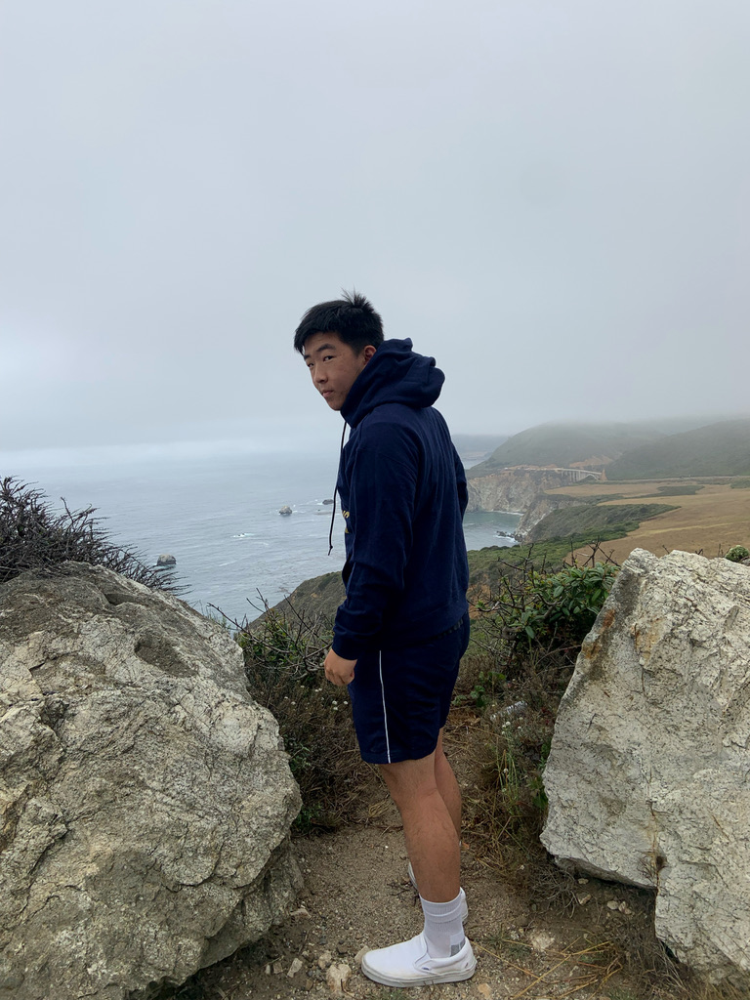

<h2 style = "text-align: center">Steven Hsu</h2>

---

<ul style = "display: flex; flex-flow: row wrap; list-style-type: none;">
    <li style = "text-align: left; width: 33.33333%; font-family: Georgia, serif;"> stevenhsu5679@gmail.com</li>
    <li style = "text-align: center; width: 33.33333%; font-family: Georgia, serif;"><a href="https://www.linkedin.com/in/steven-hsu-55bb9324a">Linkedin</a></li>
    <li style = "text-align: right; 
    width: 33.33333%; font-family: Georgia, serif;"><a href="https://github.com/StevenHsu5679">Personal GitHub</a></li></li>
</ul>


  
  You can find this image on github through the relative link [picture.jpeg](picture.jpeg)

<h2 style = "text-align: center">Fun Facts</h2>

---

My favorite quote is: 
> “You miss 100% of the shots you don’t take – Wayne Gretzky – Michael Scott”

---

My favorite programming languages in order are:
1. **C++**
2. **JS**
3. **Python**

```
include <iostream>

int main() {
    cout << "Hello World!" << endl;
}
```

---
<h2>Songs</h2>

Some of my favorite songs in no particular order:

- Forrest Gump - Frank Ocean
- Stargazing - The Neighborhood
- Cigarette Daydreams - Cage the Elephant
- Forget It - Blood Orange
- Charcoal Baby - Blood Orange
- Champagne Coast - Blood Orange
- Skin - Dijon
- Self Care - Mac Miller
- OMG - New Jeans

---

<h2>Shows/Movies</h2>

Some Shows/Movies that I want to watch/have watched:
- [x] Last of Us
- [x] Flower of Evil
- [ ] Super Mario Movie
- [ ] Solo Leveling Anime
- [ ] Better Call Saul

